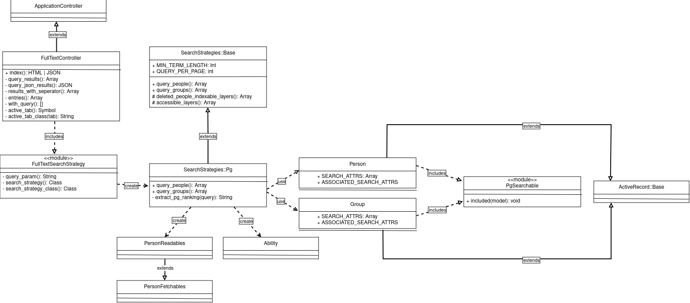

# Hitobito Suchmodul

## SearchStrategies

Das Hitobito Suchmodul basiert auf dem SearchStrategy Modul. Das SearchStrategy Modul ermöglicht es verschiedene Suchstrategien zu implementieren und zwischen diesen zu wechseln. Für die Architektur des SearchStrategy Moduls wird ein Factory Pattern verwendet.



In SearchStrategy::Base werden alle Methoden definiert, welche eine erbende Klasse überschreiben soll. Mit dem FullTextSearchStrategy Module kann überall die aktuell aktive SearchStrategy verwendet werden.

Ein gutes Beispiel für die Verwendung von diesem FullTextSearchStrategy Modul ist im FullTextController zu finden.

## Suchbare Attribute

Die suchbaren Attribute werden auf dem jeweiligen Model in `SEARCH_ATTRS` oder `ASSOCIATED_SEARCH_ATTRS` erfasst.

`SEARCH_ATTRS`: Attribute, auf aktuellem Model
`ASSOCIATED_SEARCH_ATTRS`: Attribute, auf anderen Models, mit Beziehung auf aktuelles Model.

Um in einem Wagon suchbare Attribute hinzuzufügen oder zu entfernen, muss das gewünschte Model erweitert werden.

```
included do
    Person::SEARCH_ATTRS << :id
end
```

## Model suchbar machen

Um die Postgresql Fulltextsearch auf einem Model zu aktivieren, muss `PgSearchable` in das Model eingebunden werden
